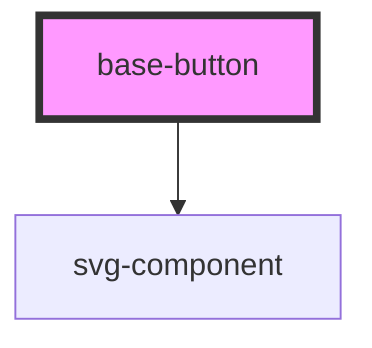

# base-button

<!-- Auto Generated Below -->

## Properties

| Property       | Attribute       | Description | Type      | Default     |
| -------------- | --------------- | ----------- | --------- | ----------- |
| `bgColor`      | `bg-color`      |             | `string`  | `undefined` |
| `bgHighlight`  | `bg-highlight`  |             | `string`  | `undefined` |
| `buttonLink`   | `button-link`   |             | `string`  | `undefined` |
| `buttonTag`    | `button-tag`    |             | `string`  | `undefined` |
| `icon`         | `icon`          |             | `string`  | `undefined` |
| `iconPosition` | `icon-position` |             | `"right"` | `undefined` |
| `text`         | `text`          |             | `string`  | `undefined` |
| `title`        | `title`         |             | `string`  | `undefined` |

## Dependencies

### Depends on

- [svg-component](../Svg-Component)

### Graph

----------------------------------------------

*Built with [StencilJS](https://stenciljs.com/)*
