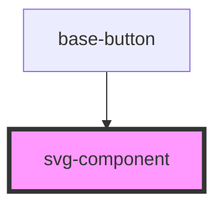

# svg-compo

<!-- Auto Generated Below -->

## Properties

| Property | Attribute | Description   | Type     | Default     |
| -------- | --------- | ------------- | -------- | ----------- |
| `icon`   | `icon`    | The icon type | `string` | `undefined` |

## Shadow Parts

| Part     | Description |
| -------- | ----------- |
| `"icon"` |             |

## Dependencies

### Used by

 - [base-button](../Button)

### Graph

----------------------------------------------

*Built with [StencilJS](https://stenciljs.com/)*
